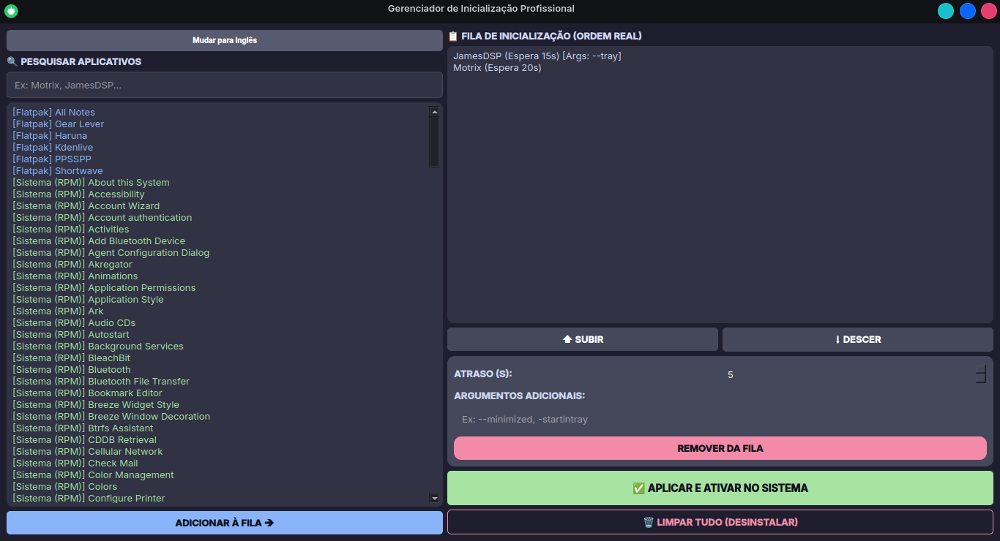

# 🚀 Startup Manager (KDE Plasma)

<p align="center">
  
</p>

O **Startup Manager** é um utilitário leve desenvolvido em Python e PyQt6 para o ecossistema Fedora/KDE. Ele permite gerenciar o atraso (delay) na inicialização de aplicativos, garantindo um carregamento de sistema mais fluido e organizado, evitando que vários apps disputem recursos ao mesmo tempo no boot.

---

## ✨ Funcionalidades

- **⏳ Gestão de Delay: Define segundos de espera personalizados para qualquer aplicação.
- **⌨️ Argumentos Personalizados: Suporte para comandos adicionais na inicialização dos apps.
- **🌍 Interface Bilingue: Deteção automática do idioma do sistema (PT-BR/EN) com opção de troca manual.
- **📦 Multi-formato: Disponível como pacote nativo Fedora (RPM) e pacote universal (AppImage).

---

## 📥 Instalação

### 🛡️ Fedora / Red Hat (RPM)
Baixe o arquivo `.rpm` na seção de [Releases] e instale via terminal:
```bash
sudo dnf install ./startup-manager-1.0-1.noarch.rpm
```

### 🚀 Outras Distribuições (AppImage)
Para usuários de Ubuntu, Mint, Arch ou para testes rápidos, baixe o .AppImage, dê permissão de execução e execute:
```bash
chmod +x Startup_Manager-x86_64.AppImage
./Startup_Manager-x86_64.AppImage
```
**Dica:** Recomendamos o uso do **Gear Lever** para gerenciar e integrar AppImages no seu sistema.

---

## 📂 Estrutura do Repositório


| Pasta | Descrição |
| :--- | :--- |
| **src/** | Código-fonte Python (main.py e logic.py) |
| **packaging/** | Arquivos de empacotamento (.spec e .desktop) |
| **assets/** | Ícones originais em diversas resoluções |
| **build_scripts/** | Scripts de automação para gerar RPM/AppImage |

---

## 🛠️ Tecnologias Utilizadas

- **Python 3**
- **PyQt6** (Interface Gráfica)
- **RPMBuild** (Criação do pacote nativo)
- **AppImageKit / appimagetool** (Criação do pacote portátil)

---

## 🤝 Como Contribuir

1. Faça um **Fork** do projeto.
2. Crie uma **Branch** para a sua funcionalidade (`git checkout -b feature/NovaFuncao`).
3. Faça o **Commit** das suas alterações (`git commit -m 'Adiciona nova função'`).
4. Faça o **Push** para a Branch (`git push origin feature/NovaFuncao`).
5. Abra um **Pull Request**.

---
*Desenvolvido por [Lu15-F3](https://github.com/Lu15-F3)*
